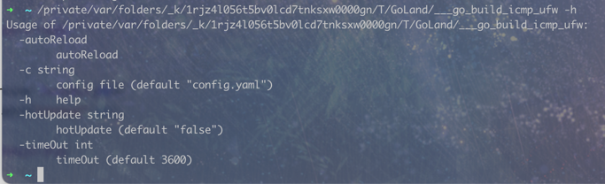

# icmp-ufw
## 通过icmp包来控制防火墙的打开(ufw / iptables)

# 实现功能
- 热加载
- 远程热更新
- 通过icmp包的size (-s)和pattern (-p)控制防火墙策略
- 支持iptables支持
- 策略时间限制
- 缓存功能，防止异常退出后策略遗留
- webhook调用 占位符支持(来源ip地址 address ,日志时间 time ,开放端口 ports)
- 更加完善的日志系统
- 全局时间限制
- icmp包的数据匹配模式

# 暂未实现（即将）
- 快速部署
- 控制nat转发规则
- 黑名单
- 在线加载黑名单
- 暴力破解防护

# 使用方法
## 1. 安装
```shell
go mod download

go build main.go

./main -h
```


## 2. 配置
```yaml
listen_interface: #监听的接口
  - lo0
firewall_program: iptables
firewall_rule_name: yonezawa
time_out: 3600 #全局超时时间
webhook_url: "http://127.0.0.1:2333/?log=[{time}]允许{address}访问{ports}端口"
webhook_method: "GET"
webhook_data: "[{time}]允许{address}访问{ports}端口"
webhook_headers:
  - "nya: nya"
hot_update: "" #热更新
auto_reload: false #自动重载配置文件
auto_reload_delay: 60 #自动重载延迟
open_ports: "80,22,7000" #默认开放端口
rules:
  - size: 56 #规则匹配的数据包大小
    time_out: 3600 #单条规则超时时间 当时间为-1时不超时
    allow_ports: 1-65535 #允许的端口
    pattern: 0xff #规则匹配的数据包内容
```

## 3. 运行
### 命令行参数
- -h 获取帮助
- -c 配置文件路径(config.yaml)
- -hotUpdate 远程热更新地址
- -autoReload 自动重载当前配置文件
- -timeOut 过期时间

## 4.开发初衷
- 通过icmp包来控制防火墙的打开，可以在不开放端口的情况下，通过icmp包来控制防火墙的打开，从而实现远程控制防火墙的功能
- 咱的数据库服务器设置了白名单 但是作为在欧洲的一台服务器，不开梯子速度慢的要死
- 而梯子又由于一些原因 可能隔一段时间ip就变了，或者切换节点，这时候就无法访问服务器，就很...不舒服
- 所以用了几个小时写了这个demo（目前） 之后会逐步完善
- 就酱～

## 5.开发日志
### 2022-11-23
- 修复了一个bug
- 优化了一下代码
- 优化了一下配置文件
- 优化了一下日志
- 将ufw改为iptables 以适配更多系统 并且实现更多功能

### 2021-11-22
- 优化代码
- 优化配置文件
- 增加了全局超时时间
- 增加了webhook回调
- 增加了规则的数据匹配模式